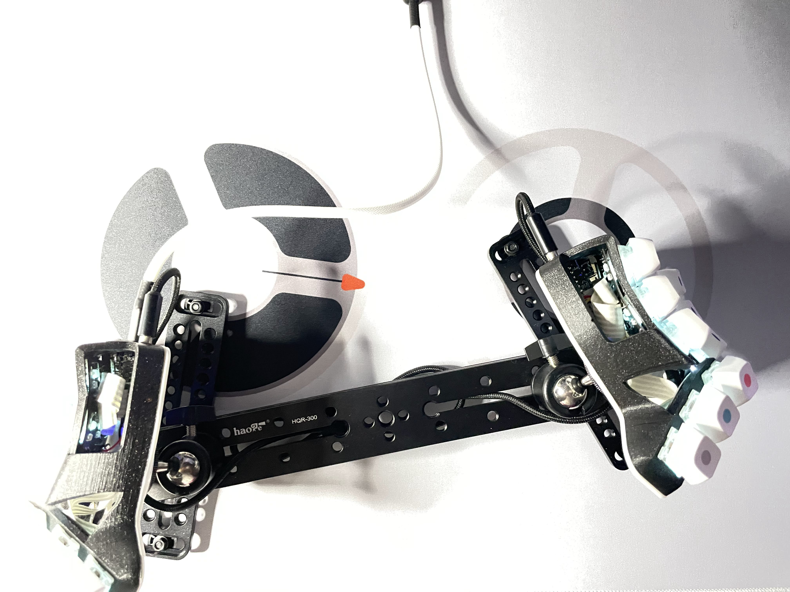
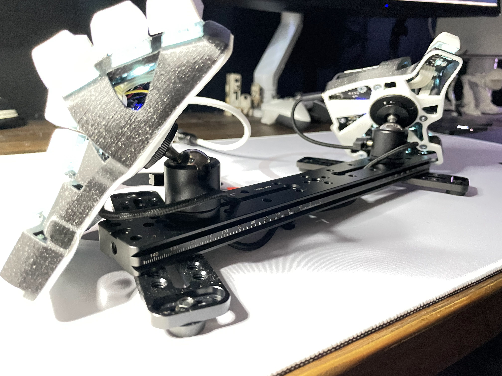
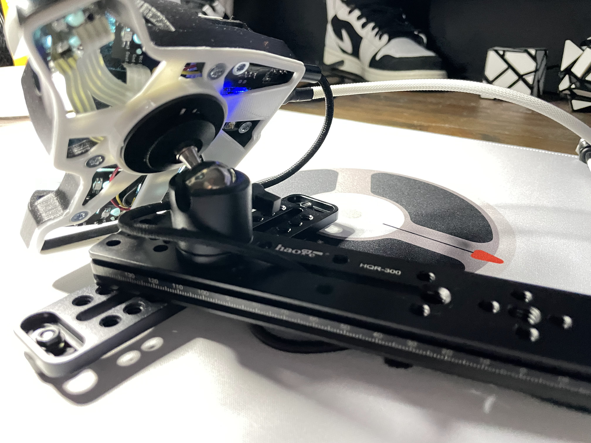

# ergo-build

Build summary: BastardKB skeletyl, camera rigging, custom printed base for pucks from splitkb.com.  
Links below images.

 

 

 

## build components

- [Bastard KB skeletyl](https://bastardkb.com/)
 - gazzew U4 switches
 - [amazon zda dots caps](https://www.amazon.com/dp/B0965HK9SQ?psc=1&ref=ppx_yo2_dt_b_product_details)

- [Split KB puck](https://splitkb.com/products/tenting-puck)

- [Custom base](puckBaseSkeletyl_v2.stl)
  - this marries the skeletyl base to the Puck

- Various camera rigging gear from amazon
  - [main beam](https://www.amazon.com/dp/B071X3RT84?psc=1&ref=ppx_yo2_dt_b_product_details)
  - [ball joint carriers](https://www.amazon.com/dp/B07K2XPVDW?ref=ppx_yo2_dt_b_product_details&th=1)
  - [stabilizing legs](https://www.amazon.com/dp/B07YWNC97B?psc=1&ref=ppx_yo2_dt_b_product_details) (x2)
  - feet
    - currently using rubber things from the hardware store, but will be testing [track spikes](https://www.amazon.com/gp/product/B085X8PFLS/ref=ppx_yo_dt_b_asin_title_o01_s00?ie=UTF8&th=1) 

- [Mechcables USB-C](https://mechcables.com/)
